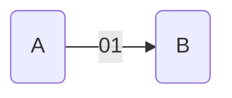

# 奇偶校验码

## 一、 校验原理简介

数据传输过程中可能发生位错误

所以我们引入奇偶校验

2bit映射到4个合法状态

| 信息 |  A   |  B   |  C   |  D   |
| :--: | :--: | :--: | :--: | :--: |
| 编码 |  00  |  01  |  10  |  11  |

3bit映射到4个合法状态（有4个冗余的非法状态）

| 信息 |     A      |     B      |     C      |     D      |
| :--: | :--------: | :--------: | :--------: | :--------: |
| 编码 | <u>1</u>00 | <u>0</u>01 | <u>0</u>10 | <u>1</u>11 |

### 码字

由若干位代码组成的一个字叫**码字**

### 距离

将两个码字逐位对比，具有不同的位的个数称为两个码字间的距离

### 码距

一种编码方案可能有若干个**合法码字**，各合法码字间的最小距离称为码距，比如上述两种编码方案中

### 分析

| 信息 |  A   |  B   |  C   |  D   |
| :--: | :--: | :--: | :--: | :--: |
| 编码 |  00  |  01  |  10  |  11  |

| 信息 |     A      |     B      |     C      |     D      |
| :--: | :--------: | :--------: | :--------: | :--------: |
| 编码 | <u>1</u>00 | <u>0</u>01 | <u>0</u>10 | <u>1</u>11 |

方案一二均有四个合法码字，码距$d=1,d=2$

当$d=1$时，无检错能力；当$d=2$时有检错能力；当$d=3$时，若设计合理，可能具有检错、纠错能力，

## 二、奇偶校验码

奇校验码：令1个数为奇数

偶校验码：令1个数为偶数

### 偶校验的硬件实现：各位进行异或运算

比如信息位为：1010111
$$
1\oplus0\oplus1\oplus0\oplus1\oplus1\oplus1=1
$$
则校验位为1

